# RN-LB: Distributed Load Balancer System - Comprehensive Implementation Plan

## Table of Contents

1. [System Overview](#system-overview)
2. [Architecture Flowchart](#architecture-flowchart)
3. [Core Components](#core-components)
4. [TXT Record Schema](#txt-record-schema)
5. [Primary Election Algorithm](#primary-election-algorithm)
6. [Health Check and Consensus](#health-check-and-consensus)
7. [DNS Provider Abstraction](#dns-provider-abstraction)
8. [Isolation Layer Architecture](#isolation-layer-architecture)
9. [Configuration Schema](#configuration-schema)
10. [Build System](#build-system)
11. [Systemd Integration](#systemd-integration)
12. [Implementation Phases](#implementation-phases)
13. [Overall TODO List](#overall-todo-list)

---

## System Overview

RN-LB is a distributed load balancer system that coordinates multiple monitoring daemons using DNS TXT records as the sole state store. The system features per-hostname primary election, health check consensus, provider abstraction, and an optional isolation layer for API key security.

### Key Design Principles

1. **No External Database:** All coordination state stored in TXT records
2. **DNS-First Reads:** Read TXT records via DNS queries (not API) for scalability
3. **Minimal API Writes:** Write to provider API only when state changes
4. **Per-Hostname Primary:** Each hostname has its own elected primary daemon
5. **Consensus-Based Health:** Multiple daemons agree on server health
6. **Provider Agnostic:** Abstraction layer supports multiple DNS providers
7. **Optional Isolation:** Build-time flag for API key isolation via proxy layer

### API Rate Limit Compliance

Cloudflare limits: 1200 requests per 5 minutes (4 req/sec average)

With 200 hostnames and 5 daemons:
- TXT reads: Via DNS (1.1.1.1) = 0 API calls
- TXT writes: Only primary per hostname + event-driven = ~3.3 req/sec base + spikes
- Headroom: Sufficient for normal operations and failover events

---

## Architecture Flowchart

```mermaid
graph TB
    subgraph "Client Layer"
        CLIENT[Client Computer]
    end

    subgraph "DNS Layer"
        PROXY[Cloudflare Proxy]
        AUTH_DNS[Authoritative DNS<br/>1.1.1.1]
        A_RECORDS[A Records<br/>hostname -> IPs]
        TXT_RECORDS[TXT Records<br/>_rn-lb-* metadata]
    end

    subgraph "Origin Servers"
        SRV1[Server 1<br/>ONLINE]
        SRV2[Server 2<br/>ONLINE]
        SRV3[Server 3<br/>OFFLINE]
    end

    subgraph "Daemon Cluster - Hostname A"
        D1[Daemon 1<br/>PRIMARY]
        D2[Daemon 2<br/>SECONDARY]
        D3[Daemon 3<br/>SECONDARY]
    end

    subgraph "Daemon Cluster - Hostname B"
        D4[Daemon 1<br/>SECONDARY]
        D5[Daemon 2<br/>PRIMARY]
        D6[Daemon 3<br/>SECONDARY]
    end

    subgraph "Isolation Layer (Optional)"
        PROXY1[API Proxy 1]
        PROXY2[API Proxy 2<br/>Fallback]
    end

    subgraph "DNS Provider"
        CF_API[Cloudflare API]
    end

    %% Client to DNS flow
    CLIENT -->|1. DNS Query| PROXY
    PROXY -->|2. Proxied Request| SRV1
    PROXY -->|2. Proxied Request| SRV2
    CLIENT -.->|DNS Query for TXT| AUTH_DNS
    AUTH_DNS -.->|TXT Response| CLIENT

    %% DNS Records
    PROXY -.->|Resolves via| A_RECORDS
    AUTH_DNS -.->|Serves| TXT_RECORDS

    %% Health Checks
    D1 -->|HTTP Health Check| SRV1
    D1 -->|HTTP Health Check| SRV2
    D1 -->|HTTP Health Check| SRV3
    D2 -->|HTTP Health Check| SRV1
    D2 -->|HTTP Health Check| SRV2
    D2 -->|HTTP Health Check| SRV3
    D3 -->|HTTP Health Check| SRV1
    D3 -->|HTTP Health Check| SRV2
    D3 -->|HTTP Health Check| SRV3

    %% DNS Reads (all daemons)
    D1 -.->|Read TXT Records<br/>DNS Query| AUTH_DNS
    D2 -.->|Read TXT Records<br/>DNS Query| AUTH_DNS
    D3 -.->|Read TXT Records<br/>DNS Query| AUTH_DNS
    D4 -.->|Read TXT Records<br/>DNS Query| AUTH_DNS
    D5 -.->|Read TXT Records<br/>DNS Query| AUTH_DNS
    D6 -.->|Read TXT Records<br/>DNS Query| AUTH_DNS

    %% API Writes (primary only or via isolation)
    D1 -->|Update A + TXT<br/>if PRIMARY| PROXY1
    D5 -->|Update A + TXT<br/>if PRIMARY| PROXY1
    PROXY1 -.->|Fallback| PROXY2
    PROXY1 -->|JWT Auth + Forward| CF_API
    PROXY2 -->|JWT Auth + Forward| CF_API
    CF_API -->|Updates| A_RECORDS
    CF_API -->|Updates| TXT_RECORDS

    %% Alternative: Direct API (no isolation)
    D1 -.->|"Direct API<br/>(no isolation build)"| CF_API
    D5 -.->|"Direct API<br/>(no isolation build)"| CF_API

    style D1 fill:#90EE90
    style D5 fill:#90EE90
    style SRV3 fill:#FFB6C6
    style PROXY1 fill:#FFE4B5
    style PROXY2 fill:#FFE4B5
```



### Flow Description

1. **Client Request Flow:**
   - Client queries DNS for hostname
   - DNS returns A records (managed by RN-LB)
   - Cloudflare proxy forwards request to healthy origin server
   - Only healthy servers are in A records

2. **Daemon Health Check Flow:**
   - All daemons perform independent health checks on all configured servers
   - Each daemon maintains local view of server health
   - Health checks run at configured interval (default: 30s)

3. **Daemon Coordination Flow:**
   - All daemons read TXT records via DNS queries (not API)
   - TXT records contain: primary identity, health reports, consensus state
   - Primary daemon for each hostname writes updates to API
   - Secondaries monitor and write witness records on disagreement

4. **Primary Election Flow:**
   - Per-hostname election using term/epoch and lease mechanism
   - Primary maintains lease by updating heartbeat timestamp
   - Secondaries challenge for primary if lease expires
   - Election state stored in `_rn-lb-primary.<hostname>` TXT record

5. **API Update Flow (with Isolation):**
   - Primary daemon sends HTTP/REST request with JWT to API proxy
   - Proxy validates JWT and hostname whitelist
   - Proxy forwards to Cloudflare API (or other provider)
   - Fallback to secondary proxy if primary proxy is down

6. **API Update Flow (without Isolation):**
   - Primary daemon calls provider API directly
   - Same code paths, different build tags

---

## Core Components

### 1. Daemon (rn-lb or rn-lb-main)

The main monitoring daemon that runs on each node. Responsible for:

- Loading and validating configuration
- Generating or loading daemon ID
- Performing health checks on origin servers
- Reading coordination state from TXT records via DNS
- Participating in primary election per hostname
- Writing state updates to DNS provider (if primary)
- Handling graceful shutdown and config reload (SIGHUP)

**Key Modules:**
- `config`: Configuration loading and validation
- `daemon`: Daemon lifecycle and ID management
- `health`: Health check execution and result tracking
- `consensus`: Health consensus algorithm
- `election`: Primary election logic
- `coordinator`: Main coordination loop
- `provider`: DNS provider abstraction interface
- `client`: HTTP client for isolation layer (if enabled)

### 2. API Proxy (rn-lb-proxy)

Optional isolation layer that proxies API requests. Only built with isolation flag.

Responsible for:
- Receiving HTTP/REST requests from main daemons
- Validating JWT authentication
- Checking hostname whitelist authorization
- Forwarding requests to DNS provider API
- Rate limiting and request logging
- Handling multiple provider configurations

**Key Modules:**
- `server`: HTTP server and routing
- `auth`: JWT validation
- `acl`: Hostname whitelist checking
- `provider`: DNS provider API clients
- `ratelimit`: Request rate limiting

### 3. Provider Implementations

Abstract interface with concrete implementations per DNS provider.

**Interface Operations:**
- `ListDNSRecords(hostname, recordType) -> []Record`
- `CreateDNSRecord(hostname, recordType, content, ttl) -> Record`
- `UpdateDNSRecord(recordID, content) -> Record`
- `DeleteDNSRecord(recordID) -> error`

**Implementations:**
- Cloudflare (initial implementation)
- Route53 (documented as potential)
- DigitalOcean DNS (documented as potential)
- Google Cloud DNS (documented as potential)

### 4. DNS Query Client

Reads TXT records via direct DNS queries, bypassing API.

Responsible for:
- Querying configured DNS server (e.g., 1.1.1.1)
- Parsing TXT record contents
- Handling DNS query failures and retries
- Caching results with TTL awareness

### 5. Health Check Engine

Executes health checks and maintains local state.

Responsible for:
- HTTP/HTTPS health checks with configurable timeouts
- TCP port checks (future)
- Custom script execution (future)
- Retry logic with exponential backoff
- Result caching and history

### 6. Consensus Engine

Determines true health state from multiple daemon reports.

Responsible for:
- Aggregating health reports from TXT records
- Detecting isolated daemons (all-down from single source)
- Applying configurable threshold rules
- Handling quorum requirements
- Preventing full removal on total failure

---

## TXT Record Schema

All coordination state is stored in TXT records under the managed hostname. TXT records are read via DNS queries and written via provider API.

### Record Naming Convention

- `_rn-lb-primary.<hostname>` - Primary election and lease
- `_rn-lb-health.<hostname>` - Health check results
- `_rn-lb-consensus.<hostname>` - Consensus state
- `_rn-lb-witness-<daemon-id>.<hostname>` - Witness records (optional)

### 1. Primary Election Record: `_rn-lb-primary.<hostname>`

Stores the current primary daemon identity and lease information.

**Format:**
```
v=1;daemon=<daemon-id>;term=<epoch>;lease=<timestamp>;priority=<int>
```

**Fields:**
- `v`: Schema version (currently 1)
- `daemon`: Current primary daemon ID
- `term`: Election term/epoch number (monotonically increasing)
- `lease`: Unix timestamp when lease expires (current time + lease duration)
- `priority`: Priority value for tie-breaking (configurable per daemon)

**Example:**
```
v=1;daemon=daemon-a1b2c3d4;term=42;lease=1727740800;priority=100
```

**Update Frequency:**
- Written by primary every 30-60 seconds (heartbeat)
- Written by challenger when becoming new primary
- Read by all daemons every coordination cycle

### 2. Health Check Results: `_rn-lb-health.<hostname>`

Stores recent health check results from all daemons.

**Format:**
```
v=1;reports=<daemon-id>:<server-states>:<timestamp>,<daemon-id>:<server-states>:<timestamp>,...
```

**Server States Format:**
- Server IDs from config separated by `|`
- Each server: `<server-id>=<status>`
- Status: `UP`, `DOWN`, `UNKNOWN`

**Example:**
```
v=1;reports=daemon-abc:srv1=UP|srv2=UP|srv3=DOWN:1727740800,daemon-xyz:srv1=UP|srv2=DOWN|srv3=DOWN:1727740795
```

**Update Frequency:**
- Written by primary after each health check cycle
- May include aggregated reports from secondaries
- Read by all daemons to understand cluster-wide health view

### 3. Consensus State: `_rn-lb-consensus.<hostname>`

Stores the agreed-upon health state and metadata.

**Format:**
```
v=1;healthy=<server-ids>;unhealthy=<server-ids>;isolated=<daemon-ids>;updated=<timestamp>
```

**Fields:**
- `v`: Schema version
- `healthy`: Comma-separated list of healthy server IDs
- `unhealthy`: Comma-separated list of unhealthy server IDs
- `isolated`: Comma-separated list of daemons detected as network-isolated
- `updated`: Last update timestamp

**Example:**
```
v=1;healthy=srv1,srv2;unhealthy=srv3;isolated=;updated=1727740800
```

**Update Frequency:**
- Written by primary when consensus state changes
- Read by all daemons and used for decision-making

### 4. Witness Records: `_rn-lb-witness-<daemon-id>.<hostname>` (Optional)

Secondary daemons can write witness records when they disagree with primary's consensus.

**Format:**
```
v=1;daemon=<daemon-id>;disagree=<reason>;healthy=<server-ids>;timestamp=<timestamp>
```

**Fields:**
- `v`: Schema version
- `daemon`: Witness daemon ID
- `disagree`: Reason code (e.g., `HEALTH_MISMATCH`, `PRIMARY_TIMEOUT`)
- `healthy`: Witness's view of healthy servers
- `timestamp`: When witness was written

**Example:**
```
v=1;daemon=daemon-xyz;disagree=HEALTH_MISMATCH;healthy=srv1,srv2,srv3;timestamp=1727740800
```

**Update Frequency:**
- Written by secondaries only when disagreement detected
- Triggers primary to re-evaluate consensus
- Cleaned up after disagreement resolved

### TXT Record Parsing

All TXT records use semicolon-delimited key=value format for consistency and parseability.

**Parsing Rules:**
- Split on `;` for key-value pairs
- Split on `=` for key and value
- Split on `,` for lists within values
- Split on `:` for structured sub-fields
- Split on `|` for inline lists

**Go Example:**
```go
func parseTXTRecord(content string) (map[string]string, error) {
    result := make(map[string]string)
    pairs := strings.Split(content, ";")
    for _, pair := range pairs {
        kv := strings.SplitN(pair, "=", 2)
        if len(kv) != 2 {
            return nil, fmt.Errorf("invalid key=value pair: %s", pair)
        }
        result[kv[0]] = kv[1]
    }
    return result, nil
}
```

### TXT Record Size Limits

DNS TXT records have size limitations:
- Single TXT string: 255 characters
- Multiple strings can be concatenated
- Practical limit: ~1000-2000 characters total

**Mitigation Strategies:**
1. Use short server IDs (e.g., `s1`, `s2` instead of full hostnames)
2. Rotate old reports out of health record (keep last 5 reports)
3. Split data across multiple TXT records if needed
4. Compress witness records (only write when necessary)

---

## Primary Election Algorithm

Each hostname has an independent primary election. The primary is responsible for writing DNS updates for that hostname.

### Election Mechanism: Term/Epoch with Lease

**Core Concepts:**

1. **Term/Epoch:** Monotonically increasing number that identifies an election cycle
2. **Lease:** Time-bound ownership of primary role
3. **Priority:** Tie-breaker when multiple daemons compete
4. **Heartbeat:** Regular updates to maintain lease

### Election States

Each daemon maintains a state machine per hostname:

- `FOLLOWER`: Not primary, monitoring current primary
- `CANDIDATE`: Attempting to become primary
- `PRIMARY`: Currently holding primary role

### State Transitions

```
FOLLOWER -> CANDIDATE: Lease expired OR no primary exists
CANDIDATE -> PRIMARY: Successfully wrote primary record with new term
CANDIDATE -> FOLLOWER: Discovered higher term OR another daemon won
PRIMARY -> FOLLOWER: Failed to renew lease OR discovered higher term
```

### Election Algorithm Details

**1. Initial State (No Primary):**

When daemon starts or detects no `_rn-lb-primary.<hostname>` record:

```
1. Read current primary record via DNS
2. If record missing or expired:
   a. Wait random backoff (0-5 seconds) to avoid thundering herd
   b. Transition to CANDIDATE
   c. Attempt to write primary record with term=1 (or last_seen_term+1)
3. If write succeeds:
   a. Transition to PRIMARY
   b. Start heartbeat loop
4. If write fails (another daemon wrote first):
   a. Re-read primary record
   b. Transition to FOLLOWER
```

**2. Follower State:**

```
Every coordination cycle (60s):
1. Read primary record via DNS
2. Check lease timestamp:
   a. If lease valid and term >= local_term:
      - Remain FOLLOWER
      - Update local_term = record.term
   b. If lease expired (current_time > lease + grace_period):
      - Log: "Primary lease expired"
      - Transition to CANDIDATE
   c. If term < local_term:
      - Log: "Detected old term, waiting"
      - Remain FOLLOWER (wait for primary to catch up)
```

**3. Candidate State:**

```
On transition to CANDIDATE:
1. Increment term: new_term = max(local_term, seen_term) + 1
2. Calculate lease expiry: lease = current_time + lease_duration (60-90s)
3. Attempt to write primary record:
   record = "v=1;daemon=<id>;term=<new_term>;lease=<lease>;priority=<priority>"
4. Wait for write confirmation (API response)
5. Re-read record via DNS to confirm:
   a. If record matches our write:
      - Transition to PRIMARY
      - Log: "Became primary for <hostname> at term <new_term>"
   b. If record differs:
      - Another daemon won (higher priority or faster)
      - Transition to FOLLOWER
      - Log: "Lost election to <other_daemon>"
```

**Priority Tie-Breaking:**

If two daemons attempt to write simultaneously:
- Cloudflare API processes requests in order (eventual consistency)
- Re-read via DNS to determine winner
- Daemon with higher priority should win (if API supports conditional writes)
- Fallback: Daemon whose write persisted wins

**4. Primary State:**

```
Primary responsibilities:
1. Perform health checks
2. Aggregate health reports from TXT records
3. Calculate consensus
4. Update A records if healthy servers changed
5. Update consensus TXT record if state changed
6. Update primary TXT record every 30-60s (heartbeat)

Every heartbeat interval (30-60s):
1. Write primary record with updated lease timestamp
2. If write fails:
   a. Log: "Failed to renew lease"
   b. Re-read primary record via DNS
   c. If another daemon is primary:
      - Transition to FOLLOWER
      - Log: "Detected new primary, stepping down"
   d. If record missing or corrupted:
      - Transition to CANDIDATE
      - Attempt re-election

Every coordination cycle (60s):
1. Read all witness records
2. If multiple witnesses disagree:
   a. Re-evaluate health consensus
   b. If witness views are more recent or more accurate:
      - Update consensus
      - Delete witness records after incorporating
```

### Lease Duration and Grace Period

**Lease Duration:** 60-90 seconds (configurable)
- Long enough to avoid frequent re-elections
- Short enough for fast failover

**Grace Period:** 10-15 seconds (configurable)
- Time to account for DNS propagation delay
- Prevents premature challenges

**Heartbeat Interval:** 30-45 seconds (configurable)
- Primary updates lease at this interval
- Should be < lease_duration / 2 for safety margin

**Example Timeline:**
```
T=0:    Primary A writes lease expiry at T=90
T=30:   Primary A renews, writes lease expiry at T=120
T=60:   Primary A renews, writes lease expiry at T=180
T=90:   Primary A crashes
T=105:  Follower B sees lease expired (T=90) + grace (T=15) = challenges
T=108:  Follower B becomes primary at term=N+1
```

### Split-Brain Prevention

**Scenario:** Network partition causes multiple daemons to think they are primary.

**Mitigation:**

1. **Term Numbers:** Higher term always wins
   - If Primary A (term 5) and Primary B (term 6) both exist, B is authoritative
   - A must detect B's higher term and step down

2. **DNS as Source of Truth:**
   - All daemons read from same authoritative DNS server (1.1.1.1)
   - Only one TXT record exists per hostname
   - Last write wins (eventual consistency)

3. **Witness Records:**
   - Secondaries write witness if they see conflicting primary
   - Primary re-evaluates if multiple witnesses appear

4. **Quorum (Future Enhancement):**
   - Require majority of daemons to acknowledge primary
   - Primary must see its own record reflected in DNS within timeout
   - If not, step down

### Daemon Priority Configuration

Allow operators to prefer certain daemons as primary:

```yaml
daemon:
  priority: 100  # Higher = more likely to become primary
```

Use cases:
- Prefer daemon in same datacenter as DNS provider
- Prefer daemon with better network connectivity
- Load distribution across daemons

---

## Health Check and Consensus

### Health Check Execution

All daemons (primary and secondary) independently perform health checks on all configured servers.

**Health Check Flow:**

```
Every check_interval (30s):
1. For each server in hostname configuration:
   a. Resolve server ID to IP/hostname from config
   b. Build health check URL: protocol://server:port/path
   c. Execute HTTP(S) request with timeout
   d. Retry on failure up to max_retries
   e. Record result: UP, DOWN, or UNKNOWN
2. Store results locally with timestamp
3. Log any state changes (UP -> DOWN or vice versa)
```

**Health Check Types:**

**HTTP/HTTPS Check (initial implementation):**
```go
type HTTPHealthCheck struct {
    Method       string        // GET, HEAD, POST
    Path         string        // /health, /ping, /
    Timeout      time.Duration // Per-request timeout
    Retries      int           // Number of retry attempts
    RetryWait    time.Duration // Wait between retries
    ValidStatus  []int         // Accepted status codes (default: 200-399)
    ExpectBody   string        // Optional body substring match
}
```

**TCP Check (future):**
```go
type TCPHealthCheck struct {
    Port         int
    Timeout      time.Duration
}
```

**Script Check (future):**
```go
type ScriptHealthCheck struct {
    Command      string
    Args         []string
    Timeout      time.Duration
    SuccessExit  int  // Expected exit code for success
}
```

**Health Check State Machine per Server:**

```
UNKNOWN -> UP: First successful check
UNKNOWN -> DOWN: First failed check
UP -> DOWN: Failed check (with retry)
DOWN -> UP: Successful check (may require N consecutive successes)
```

### Consensus Algorithm

The primary daemon aggregates health check results from all daemons and determines the true health state.

**Consensus Flow (executed by primary):**

```
Every coordination cycle (60s):
1. Read _rn-lb-health.<hostname> TXT record
2. Parse all daemon reports (daemon_id, server_states, timestamp)
3. For each server:
   a. Collect votes from all daemons
   b. Filter out stale reports (older than threshold)
   c. Apply consensus rules
   d. Determine final state: UP or DOWN
4. Compare with previous consensus state
5. If changed:
   a. Update A records (add/remove IPs)
   b. Update _rn-lb-consensus.<hostname> TXT record
6. Update _rn-lb-health.<hostname> with all reports
```

**Consensus Rules:**

**Rule 1: Quorum Requirement**
```
min_reporters = config.consensus.min_reporters (default: 2)

If reporting_daemons < min_reporters:
  - Log warning: "Insufficient reporters"
  - Use last known consensus state
  - Mark state as "uncertain" in TXT record
```

**Rule 2: Isolation Detection**
```
For each daemon D:
  If D reports all servers DOWN AND majority of other daemons report >50% UP:
    - Mark D as "isolated"
    - Exclude D's votes from consensus
    - Log: "Daemon D appears network-isolated"
```

**Rule 3: Threshold Voting**
```
threshold = config.consensus.threshold (default: 0.5)

For each server S:
  up_votes = count of non-isolated daemons reporting S as UP
  total_votes = count of non-isolated daemons
  
  If up_votes / total_votes >= threshold:
    S is UP
  Else:
    S is DOWN
```

**Rule 4: All-Down Protection**
```
If all daemons report all servers DOWN:
  - Do NOT remove all A records
  - Log: "All servers reported down by all daemons - potential systemic issue"
  - Keep last known healthy A records
  - Update consensus TXT with "all_down=true" flag
  - Optional: Send alert/notification
  
Rationale: DNS negative caching is longer than positive caching.
If we remove all A records, clients will cache NXDOMAIN/NODATA.
When servers recover, clients won't query again for TTL period.
Better to keep stale records than remove entirely.
```

**Rule 5: Tie Breaking**
```
If votes are exactly split (50/50):
  - Prefer UP to avoid flapping
  - Log: "Tie vote for server S, keeping as UP"
```

### Consensus Examples

**Example 1: Normal Operation**
```
Config: 3 daemons, threshold=0.5, min_reporters=2
Reports:
  - daemon-1: srv1=UP, srv2=UP, srv3=DOWN
  - daemon-2: srv1=UP, srv2=UP, srv3=DOWN
  - daemon-3: srv1=UP, srv2=DOWN, srv3=DOWN

Consensus:
  - srv1: 3/3 UP votes (100%) -> UP
  - srv2: 2/3 UP votes (67%) -> UP
  - srv3: 0/3 UP votes (0%) -> DOWN

Actions:
  - A records: srv1, srv2
  - TXT consensus: healthy=srv1,srv2;unhealthy=srv3
```

**Example 2: Isolated Daemon**
```
Config: 3 daemons, threshold=0.5, isolation_detection=true
Reports:
  - daemon-1: srv1=DOWN, srv2=DOWN, srv3=DOWN
  - daemon-2: srv1=UP, srv2=UP, srv3=DOWN
  - daemon-3: srv1=UP, srv2=UP, srv3=DOWN

Analysis:
  - daemon-1 reports all DOWN
  - daemon-2 and daemon-3 report 67% UP
  - daemon-1 likely isolated

Consensus (excluding daemon-1):
  - srv1: 2/2 UP votes (100%) -> UP
  - srv2: 2/2 UP votes (100%) -> UP
  - srv3: 0/2 UP votes (0%) -> DOWN

Actions:
  - A records: srv1, srv2
  - TXT consensus: healthy=srv1,srv2;unhealthy=srv3;isolated=daemon-1
```

**Example 3: All Down (No Action)**
```
Config: 3 daemons
Reports:
  - daemon-1: srv1=DOWN, srv2=DOWN, srv3=DOWN
  - daemon-2: srv1=DOWN, srv2=DOWN, srv3=DOWN
  - daemon-3: srv1=DOWN, srv2=DOWN, srv3=DOWN

Consensus:
  - All servers DOWN from all daemons
  - Trigger all-down protection

Actions:
  - Do NOT remove A records
  - Keep previous A records: srv1, srv2, srv3
  - TXT consensus: healthy=;unhealthy=srv1,srv2,srv3;all_down=true
  - Log warning: "All servers down - keeping stale records"
```

**Example 4: Insufficient Reporters**
```
Config: min_reporters=2
Reports:
  - daemon-1: srv1=UP, srv2=DOWN, srv3=DOWN
  - (daemon-2: not reporting - crashed)
  - (daemon-3: not reporting - crashed)

Consensus:
  - Only 1 daemon reporting, need 2
  - Use last known consensus state
  
Actions:
  - Keep existing A records unchanged
  - TXT consensus: (previous state);insufficient_reporters=true
  - Log warning: "Only 1 daemon reporting, need 2"
```

### Witness Records and Disagreement Handling

Secondaries can write witness records to signal disagreement with primary's consensus.

**When Secondaries Write Witness Records:**

1. Secondary's health check results differ significantly from consensus
2. Primary appears to be making incorrect decisions
3. Primary's heartbeat is stale but lease hasn't expired

**Witness Record Processing by Primary:**

```
Every coordination cycle:
1. List all witness records: _rn-lb-witness-*.<hostname>
2. For each witness:
   a. Parse witness daemon ID and health view
   b. Compare with current consensus
   c. If witness timestamp is more recent than last consensus update:
      - Re-run consensus with witness data included
      - If result changes:
        - Update consensus and A records
        - Log: "Consensus updated based on witness from <daemon>"
   d. Delete processed witness records
```

**Example: Witness Triggers Consensus Update**
```
Current Consensus (by Primary daemon-1):
  - srv1=UP, srv2=UP, srv3=DOWN
  - Last updated: T=100

Witness Record (by Secondary daemon-2 at T=150):
  - srv2=DOWN (disagrees with consensus)
  
Primary Re-evaluation:
  - Reads latest health checks
  - daemon-1: srv1=UP, srv2=UP, srv3=DOWN (T=100)
  - daemon-2: srv1=UP, srv2=DOWN, srv3=DOWN (T=150)
  - daemon-3: srv1=UP, srv2=DOWN, srv3=DOWN (T=148)
  
New Consensus:
  - srv1: 3/3 UP -> UP
  - srv2: 1/3 UP -> DOWN (threshold not met)
  - srv3: 0/3 UP -> DOWN

Actions:
  - Remove srv2 from A records
  - Update consensus TXT
  - Delete witness records
```

### Configuration Schema for Health and Consensus

```yaml
global:
  health:
    check_interval: 30          # Seconds between health checks
    timeout: 5000               # Health check timeout in milliseconds
    retries: 3                  # Number of retries on failure
    retry_wait: 1000            # Wait between retries in milliseconds
    
  consensus:
    coordination_interval: 60   # Seconds between coordination cycles
    min_reporters: 2            # Minimum daemons needed for consensus
    threshold: 0.5              # Fraction of votes needed (0.5 = majority)
    isolation_detection: true   # Enable isolated daemon detection
    report_ttl: 300             # Seconds before report considered stale
    all_down_protection: true   # Prevent removing all A records

entities:
  - name: app1
    hostname: app.example.com
    servers:
      - id: srv1
        ip: 192.0.2.10
        check:
          type: http
          path: /health
          valid_status: [200, 204]
      - id: srv2
        ip: 192.0.2.11
        check:
          type: http
          path: /health
      - id: srv3
        ip: 192.0.2.12
        check:
          type: tcp
          port: 80
    # Override global settings if needed
    health:
      timeout: 10000
```

---

## DNS Provider Abstraction

The system supports multiple DNS providers through an abstraction interface. Cloudflare is the initial implementation.

### Provider Interface

```go
// Provider defines the interface for DNS provider operations
type Provider interface {
    // Initialize the provider with configuration
    Init(config ProviderConfig) error
    
    // List DNS records for a hostname and type
    ListRecords(ctx context.Context, hostname string, recordType RecordType) ([]DNSRecord, error)
    
    // Create a new DNS record
    CreateRecord(ctx context.Context, params CreateRecordParams) (*DNSRecord, error)
    
    // Update an existing DNS record
    UpdateRecord(ctx context.Context, recordID string, params UpdateRecordParams) (*DNSRecord, error)
    
    // Delete a DNS record
    DeleteRecord(ctx context.Context, recordID string) error
    
    // Batch operations for efficiency
    BatchCreateRecords(ctx context.Context, params []CreateRecordParams) ([]DNSRecord, error)
    BatchDeleteRecords(ctx context.Context, recordIDs []string) error
    
    // Provider metadata
    Name() string
    RateLimits() RateLimitInfo
}

type RecordType string

const (
    RecordTypeA     RecordType = "A"
    RecordTypeAAAA  RecordType = "AAAA"
    RecordTypeTXT   RecordType = "TXT"
    RecordTypeCNAME RecordType = "CNAME"
)

type DNSRecord struct {
    ID       string
    Name     string
    Type     RecordType
    Content  string
    TTL      int
    Proxied  bool  // For providers that support proxying (Cloudflare)
}

type CreateRecordParams struct {
    Name    string
    Type    RecordType
    Content string
    TTL     int
    Proxied bool
}

type UpdateRecordParams struct {
    Content string
    TTL     int
}

type RateLimitInfo struct {
    RequestsPerSecond int
    RequestsPer5Min   int
    BurstSize         int
}

type ProviderConfig struct {
    Type      string                 // "cloudflare", "route53", etc.
    APIToken  string                 // Provider-specific auth
    AccountID string                 // Provider-specific
    ZoneID    string                 // Provider-specific
    Extra     map[string]interface{} // Provider-specific additional config
}
```

### Cloudflare Provider Implementation

```go
package provider

import (
    "context"
    "fmt"
    
    cloudflare "github.com/cloudflare/cloudflare-go"
)

type CloudflareProvider struct {
    api    *cloudflare.API
    zoneID string
}

func (p *CloudflareProvider) Init(config ProviderConfig) error {
    api, err := cloudflare.NewWithAPIToken(config.APIToken)
    if err != nil {
        return fmt.Errorf("failed to create Cloudflare client: %w", err)
    }
    p.api = api
    p.zoneID = config.ZoneID
    return nil
}

func (p *CloudflareProvider) Name() string {
    return "cloudflare"
}

func (p *CloudflareProvider) RateLimits() RateLimitInfo {
    return RateLimitInfo{
        RequestsPerSecond: 4,  // Average over 5 minutes
        RequestsPer5Min:   1200,
        BurstSize:         200,
    }
}

func (p *CloudflareProvider) ListRecords(ctx context.Context, hostname string, recordType RecordType) ([]DNSRecord, error) {
    rc := cloudflare.ZoneIdentifier(p.zoneID)
    records, _, err := p.api.ListDNSRecords(ctx, rc, cloudflare.ListDNSRecordsParams{
        Type: string(recordType),
        Name: hostname,
    })
    if err != nil {
        return nil, fmt.Errorf("failed to list records: %w", err)
    }
    
    result := make([]DNSRecord, len(records))
    for i, r := range records {
        result[i] = DNSRecord{
            ID:      r.ID,
            Name:    r.Name,
            Type:    RecordType(r.Type),
            Content: r.Content,
            TTL:     r.TTL,
            Proxied: r.Proxied != nil && *r.Proxied,
        }
    }
    return result, nil
}

func (p *CloudflareProvider) CreateRecord(ctx context.Context, params CreateRecordParams) (*DNSRecord, error) {
    rc := cloudflare.ZoneIdentifier(p.zoneID)
    proxied := params.Proxied
    createParams := cloudflare.CreateDNSRecordParams{
        Type:    string(params.Type),
        Name:    params.Name,
        Content: params.Content,
        TTL:     params.TTL,
        Proxied: &proxied,
    }
    
    record, err := p.api.CreateDNSRecord(ctx, rc, createParams)
    if err != nil {
        return nil, fmt.Errorf("failed to create record: %w", err)
    }
    
    return &DNSRecord{
        ID:      record.ID,
        Name:    record.Name,
        Type:    RecordType(record.Type),
        Content: record.Content,
        TTL:     record.TTL,
        Proxied: record.Proxied != nil && *record.Proxied,
    }, nil
}

func (p *CloudflareProvider) UpdateRecord(ctx context.Context, recordID string, params UpdateRecordParams) (*DNSRecord, error) {
    rc := cloudflare.ZoneIdentifier(p.zoneID)
    updateParams := cloudflare.UpdateDNSRecordParams{
        ID:      recordID,
        Content: params.Content,
        TTL:     params.TTL,
    }
    
    record, err := p.api.UpdateDNSRecord(ctx, rc, updateParams)
    if err != nil {
        return nil, fmt.Errorf("failed to update record: %w", err)
    }
    
    return &DNSRecord{
        ID:      record.ID,
        Name:    record.Name,
        Type:    RecordType(record.Type),
        Content: record.Content,
        TTL:     record.TTL,
        Proxied: record.Proxied != nil && *record.Proxied,
    }, nil
}

func (p *CloudflareProvider) DeleteRecord(ctx context.Context, recordID string) error {
    rc := cloudflare.ZoneIdentifier(p.zoneID)
    if err := p.api.DeleteDNSRecord(ctx, rc, recordID); err != nil {
        return fmt.Errorf("failed to delete record: %w", err)
    }
    return nil
}

func (p *CloudflareProvider) BatchCreateRecords(ctx context.Context, params []CreateRecordParams) ([]DNSRecord, error) {
    // Cloudflare doesn't have batch API, so we do sequential creates
    // with rate limiting
    results := make([]DNSRecord, 0, len(params))
    for _, p := range params {
        record, err := p.CreateRecord(ctx, p)
        if err != nil {
            return results, err
        }
        results = append(results, *record)
    }
    return results, nil
}

func (p *CloudflareProvider) BatchDeleteRecords(ctx context.Context, recordIDs []string) error {
    for _, id := range recordIDs {
        if err := p.DeleteRecord(ctx, id); err != nil {
            return err
        }
    }
    return nil
}
```

### Provider Factory

```go
package provider

import (
    "fmt"
)

// Factory creates provider instances based on configuration
func NewProvider(config ProviderConfig) (Provider, error) {
    switch config.Type {
    case "cloudflare":
        p := &CloudflareProvider{}
        if err := p.Init(config); err != nil {
            return nil, err
        }
        return p, nil
    case "route53":
        return nil, fmt.Errorf("route53 provider not yet implemented")
    case "digitalocean":
        return nil, fmt.Errorf("digitalocean provider not yet implemented")
    case "gcp":
        return nil, fmt.Errorf("gcp dns provider not yet implemented")
    default:
        return nil, fmt.Errorf("unknown provider type: %s", config.Type)
    }
}
```

### Future Provider Implementations (Documented)

**Amazon Route53:**
- API: AWS SDK for Go (aws-sdk-go-v2)
- Authentication: IAM credentials or access keys
- Rate Limits: 5 requests per second per account
- Features: Weighted routing, health checks, failover

**DigitalOcean DNS:**
- API: DigitalOcean API v2
- Authentication: Personal access token
- Rate Limits: 5000 requests per hour
- Features: Simple DNS management, no built-in proxying

**Google Cloud DNS:**
- API: Google Cloud SDK
- Authentication: Service account credentials
- Rate Limits: Quota-based, typically 400 QPS for read, 20 QPS for write
- Features: DNSSEC support, private zones

**Other Potential Providers:**
- Linode DNS
- Vultr DNS
- Namecheap
- Gandi

### Provider Selection in Configuration

```yaml
global:
  provider:
    type: cloudflare
    cloudflare:
      api_token: ${CF_API_TOKEN}
      account_id: ${CF_ACCOUNT_ID}
      zone_id: ${CF_ZONE_ID}

entities:
  - name: app1
    hostname: app.example.com
    # Can override provider per entity if needed
    provider:
      type: cloudflare
      cloudflare:
        zone_id: different-zone-id
```

---

## Isolation Layer Architecture

The isolation layer is an optional security feature that prevents API key leakage and limits blast radius if a daemon is compromised.

### Architecture Modes

**Mode 1: Monolithic (No Isolation)**
- Single binary: `rn-lb`
- Provider API calls embedded in daemon
- API keys in daemon configuration
- Use case: Trusted environments, simple deployments

**Mode 2: Split (With Isolation)**
- Two binaries: `rn-lb-main` and `rn-lb-proxy`
- Daemon sends HTTP requests to proxy
- Proxy holds API keys and forwards to provider
- Proxy enforces hostname ACLs
- Use case: Multi-tenant, zero-trust environments

### Build-Time Flag

Use Go build tags to compile different modes:

```go
// provider_direct.go
// +build !isolation

package provider

func (c *Client) callProvider(ctx context.Context, req ProviderRequest) (*ProviderResponse, error) {
    // Direct provider API call
    return c.provider.Execute(ctx, req)
}
```

```go
// provider_proxy.go
// +build isolation

package provider

func (c *Client) callProvider(ctx context.Context, req ProviderRequest) (*ProviderResponse, error) {
    // HTTP call to isolation proxy
    return c.httpClient.Post(c.proxyURL, req)
}
```

### Communication Protocol: HTTP/REST + JWT

**Request Flow:**
```
rn-lb-main -> HTTP POST -> rn-lb-proxy -> Provider API
                JWT Auth
```

**API Endpoints:**

```
POST /api/v1/dns/records/list
POST /api/v1/dns/records/create
POST /api/v1/dns/records/update
POST /api/v1/dns/records/delete
POST /api/v1/dns/records/batch-create
POST /api/v1/dns/records/batch-delete
GET  /api/v1/health
```

**Request Format:**

```json
{
  "hostname": "app.example.com",
  "operation": "create",
  "params": {
    "type": "A",
    "content": "192.0.2.10",
    "ttl": 60,
    "proxied": true
  }
}
```

**Response Format:**

```json
{
  "success": true,
  "result": {
    "id": "rec_abc123",
    "name": "app.example.com",
    "type": "A",
    "content": "192.0.2.10",
    "ttl": 60
  },
  "error": null
}
```

**Error Response:**

```json
{
  "success": false,
  "result": null,
  "error": {
    "code": "FORBIDDEN",
    "message": "hostname not allowed by ACL"
  }
}
```

### JWT Authentication

**Token Generation (offline, by operator):**

```bash
# Generate shared secret (done once)
openssl rand -base64 32 > /etc/rn-lb/jwt-secret.key

# Tokens are generated by proxy on startup or via admin API
```

**JWT Claims:**

```json
{
  "iss": "rn-lb-proxy",
  "sub": "daemon-abc123",
  "iat": 1727740800,
  "exp": 1727827200,
  "jti": "unique-token-id"
}
```

Note: Hostname ACLs are enforced by proxy config, not JWT claims. This allows dynamic ACL updates without reissuing tokens.

**Token Usage:**

```
Authorization: Bearer <JWT>
```

**Token Lifecycle:**

1. Proxy loads shared secret from config file
2. On daemon startup, daemon loads same shared secret
3. Daemon generates short-lived JWT (24 hours) and signs with secret
4. Daemon includes JWT in Authorization header for all requests
5. Proxy validates JWT signature and expiry
6. Proxy checks hostname ACL
7. If authorized, proxy forwards to provider

**Alternative: Long-Lived Tokens**

For simpler deployments, use long-lived tokens generated offline:

```bash
# Generate token with rn-lb-proxy tool
./rn-lb-proxy generate-token --secret-file /etc/rn-lb/jwt-secret.key --daemon-id daemon-abc --ttl 365d
```

### Hostname ACL in Proxy

**Proxy Configuration:**

```yaml
proxy:
  listen: 0.0.0.0:8443
  tls:
    cert: /etc/rn-lb/proxy.crt
    key: /etc/rn-lb/proxy.key
  
  jwt:
    secret_file: /etc/rn-lb/jwt-secret.key
    algorithm: HS256
  
  acl:
    # Allow daemon-abc to manage these hostnames
    daemon-abc:
      - app1.example.com
      - app2.example.com
      - "*.internal.example.com"  # Wildcard support
    
    # Allow daemon-xyz to manage these hostnames
    daemon-xyz:
      - api.example.com
  
  provider:
    type: cloudflare
    cloudflare:
      api_token: ${CF_API_TOKEN}
      zone_id: ${CF_ZONE_ID}
```

**ACL Enforcement:**

```go
func (p *Proxy) checkACL(daemonID string, hostname string) error {
    allowed, ok := p.config.ACL[daemonID]
    if !ok {
        return fmt.Errorf("daemon %s not in ACL", daemonID)
    }
    
    for _, pattern := range allowed {
        if matchHostname(pattern, hostname) {
            return nil
        }
    }
    
    return fmt.Errorf("hostname %s not allowed for daemon %s", hostname, daemonID)
}

func matchHostname(pattern, hostname string) bool {
    // Simple wildcard matching
    // *.example.com matches app.example.com but not example.com
    // Could use github.com/gobwas/glob for more complex patterns
    if strings.HasPrefix(pattern, "*.") {
        suffix := pattern[1:] // Remove *
        return strings.HasSuffix(hostname, suffix)
    }
    return pattern == hostname
}
```

### Multiple Proxy Addresses (Fallback)

Daemons can be configured with multiple proxy addresses for high availability:

```yaml
daemon:
  isolation:
    enabled: true
    proxies:
      - url: https://proxy1.internal:8443
        priority: 1
      - url: https://proxy2.internal:8443
        priority: 2
    jwt_secret_file: /etc/rn-lb/jwt-secret.key
    timeout: 10s
    retry_count: 2
```

**Fallback Logic:**

```
1. Try primary proxy (priority 1)
2. If connection fails or times out:
   a. Try next proxy (priority 2)
3. If all proxies fail:
   a. Log error
   b. Return failure to coordinator
   c. Coordinator will retry entire operation on next cycle
```

**Health Checking Proxies:**

```
Background goroutine every 30s:
1. Send GET /api/v1/health to each proxy
2. Track success/failure
3. Temporarily skip proxies that are down
4. Periodically retry failed proxies to detect recovery
```

### Proxy Implementation Structure

```
rn-lb-proxy/
  cmd/
    main.go                    # Entry point
    generate_token.go          # Token generation tool
  internal/
    server/
      server.go                # HTTP server setup
      handlers.go              # Request handlers
      middleware.go            # JWT validation, logging
    acl/
      acl.go                   # Hostname ACL checking
    provider/
      client.go                # Provider API client wrapper
    config/
      config.go                # Configuration loading
```

**Key Handler Logic:**

```go
func (s *Server) handleCreateRecord(w http.ResponseWriter, r *http.Request) {
    // Extract daemon ID from validated JWT (set by middleware)
    daemonID := r.Context().Value("daemon_id").(string)
    
    // Parse request
    var req CreateRecordRequest
    if err := json.NewDecoder(r.Body).Decode(&req); err != nil {
        writeError(w, http.StatusBadRequest, "INVALID_REQUEST", err.Error())
        return
    }
    
    // Check ACL
    if err := s.acl.Check(daemonID, req.Hostname); err != nil {
        writeError(w, http.StatusForbidden, "ACL_DENIED", err.Error())
        return
    }
    
    // Forward to provider
    result, err := s.provider.CreateRecord(r.Context(), req.Params)
    if err != nil {
        writeError(w, http.StatusInternalServerError, "PROVIDER_ERROR", err.Error())
        return
    }
    
    // Return response
    writeSuccess(w, result)
}
```

### TLS/HTTPS Considerations

Proxy should support TLS for secure communication:

```yaml
proxy:
  tls:
    enabled: true
    cert: /etc/rn-lb/proxy.crt
    key: /etc/rn-lb/proxy.key
    client_auth: false  # mTLS optional for future enhancement
```

Daemon HTTP client should verify TLS certificates:

```go
tlsConfig := &tls.Config{
    RootCAs: systemCertPool,
    // For self-signed certs in testing:
    // InsecureSkipVerify: true,
}
client := &http.Client{
    Transport: &http.Transport{
        TLSClientConfig: tlsConfig,
    },
}
```

---

## Configuration Schema

### Complete Configuration Example

```yaml
# Daemon Configuration for RN-LB

daemon:
  # Unique identifier for this daemon
  # If empty, auto-generate and save to id_file
  id: ""
  
  # File to persist daemon ID across restarts
  id_file: /var/lib/rn-lb/daemon.id
  
  # Priority for primary election (higher = more likely to become primary)
  priority: 100
  
  # DNS server to query for TXT records (use authoritative source)
  dns_server: 1.1.1.1:53
  
  # Isolation layer configuration
  isolation:
    enabled: false  # Set to true to use isolation layer
    proxies:
      - url: https://proxy1.internal:8443
        priority: 1
      - url: https://proxy2.internal:8443
        priority: 2
    jwt_secret_file: /etc/rn-lb/jwt-secret.key
    jwt_ttl: 24h
    timeout: 10s
    retry_count: 2

# Global defaults for all entities
global:
  # Health check configuration
  health:
    check_interval: 30       # Seconds between health checks
    timeout: 5000            # Health check timeout (ms)
    retries: 3               # Retry attempts on failure
    retry_wait: 1000         # Wait between retries (ms)
  
  # Consensus configuration
  consensus:
    coordination_interval: 60    # Seconds between coordination cycles
    min_reporters: 2             # Minimum daemons for valid consensus
    threshold: 0.5               # Vote threshold (0.5 = majority)
    isolation_detection: true    # Detect isolated daemons
    report_ttl: 300              # Seconds before report is stale
    all_down_protection: true    # Keep records if all servers down
  
  # Primary election configuration
  election:
    lease_duration: 90       # Seconds primary holds lease
    grace_period: 15         # Seconds grace before challenge
    heartbeat_interval: 45   # Seconds between primary heartbeats
  
  # DNS provider configuration
  provider:
    type: cloudflare
    cloudflare:
      api_token: ${CF_API_TOKEN}
      account_id: ${CF_ACCOUNT_ID}
      zone_id: ${CF_ZONE_ID}

# Entity configurations (hostnames to manage)
entities:
  - name: app1
    hostname: app.example.com
    
    # Server definitions with IDs (not exposed in TXT records)
    servers:
      - id: srv1
        address: 192.0.2.10
        check:
          type: http
          protocol: https
          port: 443
          path: /health
          method: GET
          valid_status: [200, 204]
          timeout: 3000
      
      - id: srv2
        address: 192.0.2.11
        check:
          type: http
          protocol: https
          port: 443
          path: /health
      
      - id: srv3
        address: 192.0.2.12
        check:
          type: tcp
          port: 443
    
    # DNS record configuration
    dns:
      ttl: 60
      proxied: true  # Cloudflare proxy mode
    
    # Override global settings if needed
    health:
      timeout: 10000
    
    consensus:
      threshold: 0.6  # Require 60% agreement for this hostname
  
  - name: api1
    hostname: api.example.com
    
    servers:
      - id: api-srv1
        address: 192.0.2.20
        check:
          type: http
          path: /ping
      
      - id: api-srv2
        address: 192.0.2.21
        check:
          type: http
          path: /ping
    
    # Use different provider for this entity
    provider:
      type: cloudflare
      cloudflare:
        zone_id: different-zone-id
```

### Proxy Configuration Example

```yaml
# Proxy Configuration for RN-LB (rn-lb-proxy)

proxy:
  # HTTP server configuration
  listen: 0.0.0.0:8443
  
  # TLS configuration
  tls:
    enabled: true
    cert: /etc/rn-lb/proxy.crt
    key: /etc/rn-lb/proxy.key
  
  # JWT authentication
  jwt:
    secret_file: /etc/rn-lb/jwt-secret.key
    algorithm: HS256
    
  # Rate limiting (per daemon)
  rate_limit:
    requests_per_second: 10
    burst: 20
  
  # Access control lists (hostname whitelist per daemon)
  acl:
    daemon-abc123:
      - app.example.com
      - app2.example.com
      - "*.internal.example.com"
    
    daemon-xyz789:
      - api.example.com
  
  # DNS provider configuration (same structure as daemon)
  provider:
    type: cloudflare
    cloudflare:
      api_token: ${CF_API_TOKEN}
      account_id: ${CF_ACCOUNT_ID}
      zone_id: ${CF_ZONE_ID}
  
  # Logging
  logging:
    level: info
    file: /var/log/rn-lb-proxy/proxy.log
    format: json
```

### Environment Variable Expansion

Support environment variable expansion in config files:

```yaml
provider:
  cloudflare:
    api_token: ${CF_API_TOKEN}
    zone_id: ${CF_ZONE_ID}
```

Implementation:
```go
func expandEnvVars(s string) string {
    return os.ExpandEnv(s)
}
```

### Configuration Validation

Validate configuration on startup:

1. Required fields present
2. Numeric values in valid ranges
3. Server IDs unique within entity
4. Provider credentials present
5. Isolation proxy URLs reachable (if enabled)
6. JWT secret file readable (if isolation enabled)

### Configuration Reload (SIGHUP)

Support reloading configuration without restart:

```
SIGHUP handler:
1. Re-read configuration file
2. Validate new configuration
3. If valid:
   a. Update in-memory configuration
   b. Re-initialize changed entities
   c. Keep existing election state if hostnames unchanged
   d. Log: "Configuration reloaded"
4. If invalid:
   a. Keep existing configuration
   b. Log error: "Failed to reload configuration"
```

Not reloadable without restart:
- Daemon ID
- Isolation layer settings (would require reconnecting to proxies)
- Provider type (would require reinitializing provider)

Reloadable without restart:
- Entity list (add/remove hostnames)
- Server lists per entity
- Health check parameters
- Consensus parameters
- Provider credentials (useful for key rotation)

---

## Build System

### Makefile Structure

```makefile
# Makefile for RN-LB

# Build variables
VERSION ?= $(shell git describe --tags --always --dirty)
COMMIT ?= $(shell git rev-parse HEAD)
BUILD_TIME ?= $(shell date -u '+%Y-%m-%d_%H:%M:%S')
LDFLAGS := -X main.Version=$(VERSION) -X main.Commit=$(COMMIT) -X main.BuildTime=$(BUILD_TIME)

# Go build flags
GOFLAGS := -trimpath -ldflags "$(LDFLAGS)"
ISOLATION_TAG := isolation

# Output directories
BIN_DIR := bin
DIST_DIR := dist

# Binaries
MONOLITHIC_BIN := $(BIN_DIR)/rn-lb
MAIN_BIN := $(BIN_DIR)/rn-lb-main
PROXY_BIN := $(BIN_DIR)/rn-lb-proxy

.PHONY: all build-monolithic build-split build-main build-proxy clean test install

# Default target
all: build-monolithic build-split

# Build monolithic binary (no isolation layer)
build-monolithic:
	@echo "Building monolithic binary (no isolation)..."
	@mkdir -p $(BIN_DIR)
	go build $(GOFLAGS) -o $(MONOLITHIC_BIN) ./cmd/daemon

# Build split binaries (with isolation layer)
build-split: build-main build-proxy

# Build main daemon with isolation layer support
build-main:
	@echo "Building main daemon (with isolation layer)..."
	@mkdir -p $(BIN_DIR)
	go build $(GOFLAGS) -tags $(ISOLATION_TAG) -o $(MAIN_BIN) ./cmd/daemon

# Build API proxy
build-proxy:
	@echo "Building API proxy..."
	@mkdir -p $(BIN_DIR)
	go build $(GOFLAGS) -o $(PROXY_BIN) ./cmd/proxy

# Run tests
test:
	go test -v -race -cover ./...

# Run integration tests
test-integration:
	go test -v -tags=integration ./tests/integration/...

# Clean build artifacts
clean:
	rm -rf $(BIN_DIR) $(DIST_DIR)

# Install binaries to system (requires root)
install: build-monolithic build-split
	install -m 755 $(MONOLITHIC_BIN) /usr/local/bin/
	install -m 755 $(MAIN_BIN) /usr/local/bin/
	install -m 755 $(PROXY_BIN) /usr/local/bin/
	install -d /etc/rn-lb
	install -d /var/lib/rn-lb
	install -d /var/log/rn-lb

# Install systemd service files
install-systemd:
	install -m 644 systemd/rn-lb.service /etc/systemd/system/
	install -m 644 systemd/rn-lb-proxy.service /etc/systemd/system/
	systemctl daemon-reload

# Build release packages for multiple platforms
release: clean
	@echo "Building release packages..."
	@mkdir -p $(DIST_DIR)
	# Linux AMD64
	GOOS=linux GOARCH=amd64 go build $(GOFLAGS) -o $(DIST_DIR)/rn-lb-linux-amd64 ./cmd/daemon
	GOOS=linux GOARCH=amd64 go build $(GOFLAGS) -tags $(ISOLATION_TAG) -o $(DIST_DIR)/rn-lb-main-linux-amd64 ./cmd/daemon
	GOOS=linux GOARCH=amd64 go build $(GOFLAGS) -o $(DIST_DIR)/rn-lb-proxy-linux-amd64 ./cmd/proxy
	# Linux ARM64
	GOOS=linux GOARCH=arm64 go build $(GOFLAGS) -o $(DIST_DIR)/rn-lb-linux-arm64 ./cmd/daemon
	GOOS=linux GOARCH=arm64 go build $(GOFLAGS) -tags $(ISOLATION_TAG) -o $(DIST_DIR)/rn-lb-main-linux-arm64 ./cmd/daemon
	GOOS=linux GOARCH=arm64 go build $(GOFLAGS) -o $(DIST_DIR)/rn-lb-proxy-linux-arm64 ./cmd/proxy
	# macOS AMD64
	GOOS=darwin GOARCH=amd64 go build $(GOFLAGS) -o $(DIST_DIR)/rn-lb-darwin-amd64 ./cmd/daemon
	GOOS=darwin GOARCH=amd64 go build $(GOFLAGS) -tags $(ISOLATION_TAG) -o $(DIST_DIR)/rn-lb-main-darwin-amd64 ./cmd/daemon
	GOOS=darwin GOARCH=amd64 go build $(GOFLAGS) -o $(DIST_DIR)/rn-lb-proxy-darwin-amd64 ./cmd/proxy
	# macOS ARM64
	GOOS=darwin GOARCH=arm64 go build $(GOFLAGS) -o $(DIST_DIR)/rn-lb-darwin-arm64 ./cmd/daemon
	GOOS=darwin GOARCH=arm64 go build $(GOFLAGS) -tags $(ISOLATION_TAG) -o $(DIST_DIR)/rn-lb-main-darwin-arm64 ./cmd/daemon
	GOOS=darwin GOARCH=arm64 go build $(GOFLAGS) -o $(DIST_DIR)/rn-lb-proxy-darwin-arm64 ./cmd/proxy
	@echo "Release packages built in $(DIST_DIR)/"

# Generate JWT secret for isolation layer
generate-secret:
	@echo "Generating JWT secret..."
	@openssl rand -base64 32 > jwt-secret.key
	@echo "Secret saved to jwt-secret.key"

# Development: run monolithic daemon
run-monolithic: build-monolithic
	./$(MONOLITHIC_BIN) -config config.yaml

# Development: run split daemon and proxy
run-split:
	@echo "Starting proxy in background..."
	./$(PROXY_BIN) -config proxy-config.yaml &
	@sleep 2
	@echo "Starting main daemon..."
	./$(MAIN_BIN) -config config.yaml

# Lint code
lint:
	golangci-lint run ./...

# Format code
fmt:
	go fmt ./...
	goimports -w .

# Update dependencies
deps:
	go mod tidy
	go mod verify
```

### Project Directory Structure

```
rn-lb/
  cmd/
    daemon/
      main.go              # Main daemon entry point
    proxy/
      main.go              # API proxy entry point
  internal/
    config/
      config.go            # Configuration loading
      validation.go        # Configuration validation
    daemon/
      daemon.go            # Daemon lifecycle
      id.go                # Daemon ID generation and loading
    health/
      checker.go           # Health check execution
      types.go             # Health check types
    consensus/
      consensus.go         # Consensus algorithm
      isolation.go         # Isolation detection
    election/
      election.go          # Primary election logic
      state.go             # Election state machine
    coordinator/
      coordinator.go       # Main coordination loop
      cycle.go             # Coordination cycle logic
    provider/
      interface.go         # Provider interface
      factory.go           # Provider factory
      cloudflare.go        # Cloudflare implementation
      direct.go            # Direct provider calls (no isolation)
      proxy.go             # Proxy provider calls (with isolation)
    dns/
      query.go             # DNS query client for TXT records
      parse.go             # TXT record parsing
    proxy/
      server.go            # HTTP server for proxy
      handlers.go          # Request handlers
      middleware.go        # JWT and ACL middleware
      acl.go               # Hostname ACL
    httpclient/
      client.go            # HTTP client for isolation layer
      jwt.go               # JWT generation
  tests/
    integration/
      election_test.go     # Integration tests
      consensus_test.go
      provider_test.go
  systemd/
    rn-lb.service          # Systemd service for monolithic
    rn-lb-proxy.service    # Systemd service for proxy
  examples/
    config.yaml            # Example daemon configuration
    proxy-config.yaml      # Example proxy configuration
  Makefile                 # Build system
  go.mod                   # Go module definition
  go.sum                   # Go module checksums
  LICENSE
  README.md
  PLAN.md                  # This file
```

### Build Tags for Isolation

**File: internal/provider/direct.go**
```go
// +build !isolation

package provider

// Direct provider calls when isolation is disabled
```

**File: internal/provider/proxy.go**
```go
// +build isolation

package provider

// Proxy provider calls when isolation is enabled
```

Usage:
- `go build ./cmd/daemon` - builds monolithic (no isolation tag)
- `go build -tags isolation ./cmd/daemon` - builds with isolation support

---

## Systemd Integration

### Service File: rn-lb.service (Monolithic)

```ini
[Unit]
Description=RN-LB Distributed Load Balancer (Monolithic)
Documentation=https://github.com/lahdekorpi/rn-lb
After=network-online.target
Wants=network-online.target

[Service]
Type=simple
User=rn-lb
Group=rn-lb
ExecStart=/usr/local/bin/rn-lb -config /etc/rn-lb/config.yaml
ExecReload=/bin/kill -HUP $MAINPID
Restart=on-failure
RestartSec=5s
TimeoutStopSec=30s

# Security hardening
NoNewPrivileges=true
PrivateTmp=true
ProtectSystem=strict
ProtectHome=true
ReadWritePaths=/var/lib/rn-lb /var/log/rn-lb
CapabilityBoundingSet=CAP_NET_BIND_SERVICE
AmbientCapabilities=CAP_NET_BIND_SERVICE

# Logging
StandardOutput=journal
StandardError=journal
SyslogIdentifier=rn-lb

[Install]
WantedBy=multi-user.target
```

### Service File: rn-lb-main.service (Split Mode)

```ini
[Unit]
Description=RN-LB Distributed Load Balancer (Main Daemon)
Documentation=https://github.com/lahdekorpi/rn-lb
After=network-online.target rn-lb-proxy.service
Wants=network-online.target
Requires=rn-lb-proxy.service

[Service]
Type=simple
User=rn-lb
Group=rn-lb
ExecStart=/usr/local/bin/rn-lb-main -config /etc/rn-lb/config.yaml
ExecReload=/bin/kill -HUP $MAINPID
Restart=on-failure
RestartSec=5s
TimeoutStopSec=30s

# Security hardening
NoNewPrivileges=true
PrivateTmp=true
ProtectSystem=strict
ProtectHome=true
ReadWritePaths=/var/lib/rn-lb /var/log/rn-lb
CapabilityBoundingSet=CAP_NET_BIND_SERVICE
AmbientCapabilities=CAP_NET_BIND_SERVICE

# Logging
StandardOutput=journal
StandardError=journal
SyslogIdentifier=rn-lb-main

[Install]
WantedBy=multi-user.target
```

### Service File: rn-lb-proxy.service (Split Mode)

```ini
[Unit]
Description=RN-LB API Proxy
Documentation=https://github.com/lahdekorpi/rn-lb
After=network-online.target
Wants=network-online.target

[Service]
Type=simple
User=rn-lb-proxy
Group=rn-lb-proxy
ExecStart=/usr/local/bin/rn-lb-proxy -config /etc/rn-lb/proxy-config.yaml
Restart=on-failure
RestartSec=5s
TimeoutStopSec=30s

# Security hardening
NoNewPrivileges=true
PrivateTmp=true
ProtectSystem=strict
ProtectHome=true
ReadWritePaths=/var/log/rn-lb-proxy
CapabilityBoundingSet=CAP_NET_BIND_SERVICE
AmbientCapabilities=CAP_NET_BIND_SERVICE

# Logging
StandardOutput=journal
StandardError=journal
SyslogIdentifier=rn-lb-proxy

[Install]
WantedBy=multi-user.target
```

### Installation Script

```bash
#!/bin/bash
# install.sh - Install RN-LB systemd services

set -e

MODE=${1:-monolithic}  # monolithic or split

# Create user and group
if ! id rn-lb >/dev/null 2>&1; then
    useradd -r -s /bin/false -d /var/lib/rn-lb rn-lb
fi

if [ "$MODE" = "split" ]; then
    if ! id rn-lb-proxy >/dev/null 2>&1; then
        useradd -r -s /bin/false -d /var/lib/rn-lb-proxy rn-lb-proxy
    fi
fi

# Create directories
mkdir -p /etc/rn-lb
mkdir -p /var/lib/rn-lb
mkdir -p /var/log/rn-lb

if [ "$MODE" = "split" ]; then
    mkdir -p /var/log/rn-lb-proxy
    chown rn-lb-proxy:rn-lb-proxy /var/log/rn-lb-proxy
fi

# Set permissions
chown rn-lb:rn-lb /var/lib/rn-lb
chown rn-lb:rn-lb /var/log/rn-lb
chmod 750 /etc/rn-lb
chmod 750 /var/lib/rn-lb

# Install binaries
make install

# Install systemd services
if [ "$MODE" = "monolithic" ]; then
    install -m 644 systemd/rn-lb.service /etc/systemd/system/
    systemctl daemon-reload
    systemctl enable rn-lb.service
    echo "Installed rn-lb.service"
    echo "Edit /etc/rn-lb/config.yaml and then: systemctl start rn-lb"
else
    install -m 644 systemd/rn-lb-main.service /etc/systemd/system/
    install -m 644 systemd/rn-lb-proxy.service /etc/systemd/system/
    systemctl daemon-reload
    systemctl enable rn-lb-proxy.service
    systemctl enable rn-lb-main.service
    echo "Installed rn-lb-main.service and rn-lb-proxy.service"
    echo "Edit /etc/rn-lb/config.yaml and /etc/rn-lb/proxy-config.yaml"
    echo "Then: systemctl start rn-lb-proxy && systemctl start rn-lb-main"
fi

echo "Installation complete!"
```

### Systemd Commands

```bash
# Monolithic mode
sudo systemctl start rn-lb
sudo systemctl stop rn-lb
sudo systemctl restart rn-lb
sudo systemctl reload rn-lb        # SIGHUP to reload config
sudo systemctl status rn-lb
sudo journalctl -u rn-lb -f        # Follow logs

# Split mode
sudo systemctl start rn-lb-proxy
sudo systemctl start rn-lb-main
sudo systemctl stop rn-lb-main
sudo systemctl stop rn-lb-proxy
sudo systemctl reload rn-lb-main   # SIGHUP to reload config
sudo journalctl -u rn-lb-main -f
sudo journalctl -u rn-lb-proxy -f
```

---

## Implementation Phases

### Phase 1: Core Foundation

**Goals:** Basic daemon structure, configuration, and provider abstraction

**Tasks:**
1. Project structure setup
   - Create directory layout
   - Initialize Go module
   - Setup Makefile

2. Configuration system
   - Define configuration structs
   - YAML parsing
   - Environment variable expansion
   - Validation

3. Daemon lifecycle
   - Daemon ID generation and persistence
   - Graceful shutdown
   - Signal handling (SIGTERM, SIGINT, SIGHUP)

4. Provider abstraction
   - Define Provider interface
   - Implement Cloudflare provider
   - Provider factory

5. Health check engine
   - HTTP/HTTPS health check implementation
   - Retry logic
   - Result caching

6. DNS query client
   - TXT record queries via net.LookupTXT
   - Configurable DNS server
   - Record parsing utilities

**Deliverables:**
- Working monolithic daemon (no coordination yet)
- Can perform health checks
- Can update A records via Cloudflare
- Configuration file driven
- Basic logging

**Testing:**
- Unit tests for configuration parsing
- Unit tests for health checks
- Integration test with Cloudflare API (using test zone)

### Phase 2: Coordination and Election

**Goals:** Multi-daemon coordination, primary election, TXT record schema

**Tasks:**
1. TXT record schema implementation
   - Record formatting and parsing
   - Schema versioning support

2. Primary election algorithm
   - State machine (FOLLOWER, CANDIDATE, PRIMARY)
   - Term/epoch management
   - Lease management
   - Election logic

3. Coordination loop
   - Primary coordination cycle
   - Secondary monitoring cycle
   - TXT record reading via DNS
   - State synchronization

4. Coordinator logic
   - Aggregate health checks
   - Write consensus state
   - Update A records based on consensus

**Deliverables:**
- Multiple daemons can coordinate via TXT records
- Per-hostname primary election works
- Primary updates DNS, secondaries monitor
- Graceful failover when primary crashes

**Testing:**
- Integration tests with multiple daemon instances
- Election correctness tests
- Failover tests (kill primary, verify secondary takeover)
- Split-brain scenario tests

### Phase 3: Consensus and Health Logic

**Goals:** Multi-daemon health consensus, isolation detection, edge cases

**Tasks:**
1. Consensus engine
   - Vote aggregation
   - Threshold-based decision making
   - Quorum handling

2. Isolation detection
   - Detect all-down from single daemon
   - Exclude isolated daemons from voting

3. All-down protection
   - Prevent removal of all A records
   - Logging and alerting for all-down scenarios

4. Witness records
   - Secondary disagreement detection
   - Witness record creation and cleanup
   - Primary re-evaluation based on witnesses

**Deliverables:**
- Robust consensus algorithm
- Handles isolated daemons gracefully
- Protects against full DNS removal
- Secondaries can influence primary decisions

**Testing:**
- Consensus correctness tests with various vote distributions
- Isolation detection tests (network partition simulation)
- All-down protection tests
- Witness record tests

### Phase 4: Isolation Layer

**Goals:** Optional API proxy for security isolation

**Tasks:**
1. Build system for isolation
   - Build tags for isolation vs. direct mode
   - Separate binaries (rn-lb-main, rn-lb-proxy)

2. HTTP/REST API design
   - Define API endpoints
   - Request/response format
   - Error handling

3. JWT authentication
   - JWT generation in daemon
   - JWT validation in proxy
   - Shared secret management

4. API proxy implementation
   - HTTP server
   - Request handlers
   - Provider forwarding

5. Hostname ACL
   - ACL configuration
   - ACL enforcement
   - Wildcard support

6. Fallback proxy support
   - Multiple proxy addresses
   - Failover logic
   - Health checking proxies

**Deliverables:**
- rn-lb-proxy binary
- rn-lb-main binary (with isolation enabled)
- JWT authentication works
- Hostname ACL enforced
- Fallback to secondary proxy works

**Testing:**
- Integration tests with proxy
- ACL enforcement tests
- JWT validation tests
- Proxy failover tests

### Phase 5: Production Readiness

**Goals:** Systemd integration, logging, monitoring, documentation

**Tasks:**
1. Systemd integration
   - Service files
   - Installation scripts
   - User and directory setup

2. Logging improvements
   - Structured logging (JSON)
   - Log levels (debug, info, warn, error)
   - Log rotation support

3. Metrics and observability
   - Prometheus metrics export (optional)
   - Health check latency metrics
   - Election state metrics
   - API call counters

4. Configuration reload
   - SIGHUP handler
   - Safe configuration updates
   - Validation on reload

5. Documentation
   - Installation guide
   - Configuration reference
   - Operational runbook
   - Troubleshooting guide

6. Error handling and recovery
   - Retry logic for transient failures
   - Graceful degradation
   - Circuit breaker for provider API

**Deliverables:**
- Production-ready systemd services
- Comprehensive logging
- Metrics for monitoring
- Complete documentation
- Robust error handling

**Testing:**
- End-to-end production simulation tests
- Chaos testing (random daemon crashes, network issues)
- Performance tests (many hostnames, many daemons)

### Phase 6: Additional Features (Future)

**Optional enhancements for future releases:**

1. Additional health check types
   - TCP port checks
   - Custom script execution
   - ICMP ping checks

2. Additional DNS providers
   - Route53 implementation
   - DigitalOcean DNS implementation
   - Google Cloud DNS implementation

3. Advanced consensus features
   - Configurable vote weights per daemon
   - Geographic awareness (prefer local daemons)
   - Time-based health patterns (ignore transient failures)

4. Web UI for monitoring
   - Dashboard showing daemon status
   - Real-time health check results
   - Manual override capability

5. Alerting integration
   - Webhook support for alerts
   - Email notifications
   - Slack/Discord integration

6. Backup provider support
   - Failover to secondary DNS provider if primary fails
   - Multi-provider configuration

---

## Overall TODO List

### Phase 1: Core Foundation
- [ ] Initialize project structure and Go module
- [ ] Create Makefile with build targets
- [ ] Implement configuration structs and YAML parsing
- [ ] Add environment variable expansion support
- [ ] Implement configuration validation
- [ ] Create daemon lifecycle management (start, stop, reload)
- [ ] Implement daemon ID generation and persistence
- [ ] Add signal handling (SIGTERM, SIGINT, SIGHUP)
- [ ] Define Provider interface
- [ ] Implement Cloudflare provider
- [ ] Create provider factory
- [ ] Implement HTTP/HTTPS health check
- [ ] Add health check retry logic
- [ ] Implement DNS TXT record query client
- [ ] Add TXT record parsing utilities
- [ ] Write unit tests for configuration
- [ ] Write unit tests for health checks
- [ ] Write integration test with Cloudflare API
- [ ] Basic logging implementation

### Phase 2: Coordination and Election
- [ ] Define TXT record schema for all record types
- [ ] Implement TXT record formatting functions
- [ ] Implement TXT record parsing functions
- [ ] Create election state machine (FOLLOWER, CANDIDATE, PRIMARY)
- [ ] Implement term/epoch management
- [ ] Implement lease management
- [ ] Write primary election logic
- [ ] Implement primary coordination loop
- [ ] Implement secondary monitoring loop
- [ ] Add TXT record reading via DNS
- [ ] Implement state synchronization
- [ ] Write coordinator logic for primary
- [ ] Add A record update logic
- [ ] Write integration tests for multi-daemon setup
- [ ] Write election correctness tests
- [ ] Write failover tests
- [ ] Test split-brain scenarios

### Phase 3: Consensus and Health Logic
- [ ] Implement vote aggregation in consensus engine
- [ ] Add threshold-based decision logic
- [ ] Implement quorum handling
- [ ] Write isolation detection algorithm
- [ ] Exclude isolated daemons from voting
- [ ] Implement all-down protection logic
- [ ] Add witness record creation for secondaries
- [ ] Implement witness record cleanup
- [ ] Add primary re-evaluation based on witnesses
- [ ] Write consensus correctness tests
- [ ] Write isolation detection tests
- [ ] Write all-down protection tests
- [ ] Write witness record tests

### Phase 4: Isolation Layer
- [ ] Add build tags for isolation mode
- [ ] Update Makefile for split builds
- [ ] Design HTTP/REST API for proxy
- [ ] Implement JWT generation in daemon
- [ ] Implement JWT validation in proxy
- [ ] Create shared secret management
- [ ] Implement proxy HTTP server
- [ ] Write proxy request handlers
- [ ] Add provider forwarding in proxy
- [ ] Implement hostname ACL configuration
- [ ] Add ACL enforcement logic
- [ ] Add wildcard hostname support in ACL
- [ ] Implement multiple proxy address support
- [ ] Add proxy failover logic
- [ ] Implement proxy health checking
- [ ] Write integration tests with proxy
- [ ] Write ACL enforcement tests
- [ ] Write JWT validation tests
- [ ] Write proxy failover tests

### Phase 5: Production Readiness
- [ ] Create systemd service files (monolithic and split)
- [ ] Write installation script
- [ ] Add user and directory setup
- [ ] Implement structured logging (JSON)
- [ ] Add log levels (debug, info, warn, error)
- [ ] Configure log rotation
- [ ] Add Prometheus metrics export (optional)
- [ ] Implement health check latency metrics
- [ ] Add election state metrics
- [ ] Add API call counters
- [ ] Implement SIGHUP configuration reload
- [ ] Add configuration validation on reload
- [ ] Write retry logic for transient failures
- [ ] Implement graceful degradation
- [ ] Add circuit breaker for provider API
- [ ] Write installation guide
- [ ] Write configuration reference documentation
- [ ] Write operational runbook
- [ ] Write troubleshooting guide
- [ ] Perform end-to-end production simulation tests
- [ ] Perform chaos testing (daemon crashes, network issues)
- [ ] Perform performance tests (many hostnames, many daemons)

### Phase 6: Additional Features (Future)
- [ ] Implement TCP port health checks
- [ ] Add custom script health checks
- [ ] Add ICMP ping health checks
- [ ] Implement Route53 provider
- [ ] Implement DigitalOcean DNS provider
- [ ] Implement Google Cloud DNS provider
- [ ] Add configurable daemon vote weights
- [ ] Add geographic awareness for consensus
- [ ] Implement time-based health pattern analysis
- [ ] Create web UI dashboard
- [ ] Add manual override capability in UI
- [ ] Implement webhook alerting
- [ ] Add email notification support
- [ ] Add Slack/Discord integration
- [ ] Implement backup provider support
- [ ] Add multi-provider configuration

### Documentation
- [ ] Write README.md with overview and quick start
- [ ] Document TXT record schema in detail
- [ ] Create architecture diagram
- [ ] Write API documentation for isolation layer
- [ ] Document systemd integration
- [ ] Write operator guide for common tasks
- [ ] Create troubleshooting guide
- [ ] Document provider implementation guide for contributors
- [ ] Add examples directory with sample configs

### Testing
- [ ] Unit test coverage >80%
- [ ] Integration test suite
- [ ] End-to-end test scenarios
- [ ] Performance benchmarks
- [ ] Chaos engineering tests
- [ ] Security audit (JWT, ACL, input validation)

---

## End of Plan

This comprehensive plan covers all aspects of the RN-LB distributed load balancer system. The implementation will be done in phases, starting with core functionality and building up to production readiness and optional features.

Key design decisions made:
1. Term/Epoch with Lease for primary election
2. DNS queries for TXT record reads (no API overhead)
3. Hybrid coordination (primary writes, secondaries witness)
4. HTTP/REST + JWT for isolation layer with fallback support
5. Comprehensive consensus with isolation detection and all-down protection
6. Build tags for monolithic vs. split architecture

The system is designed to scale to hundreds of hostnames and servers while staying within DNS provider API rate limits.
